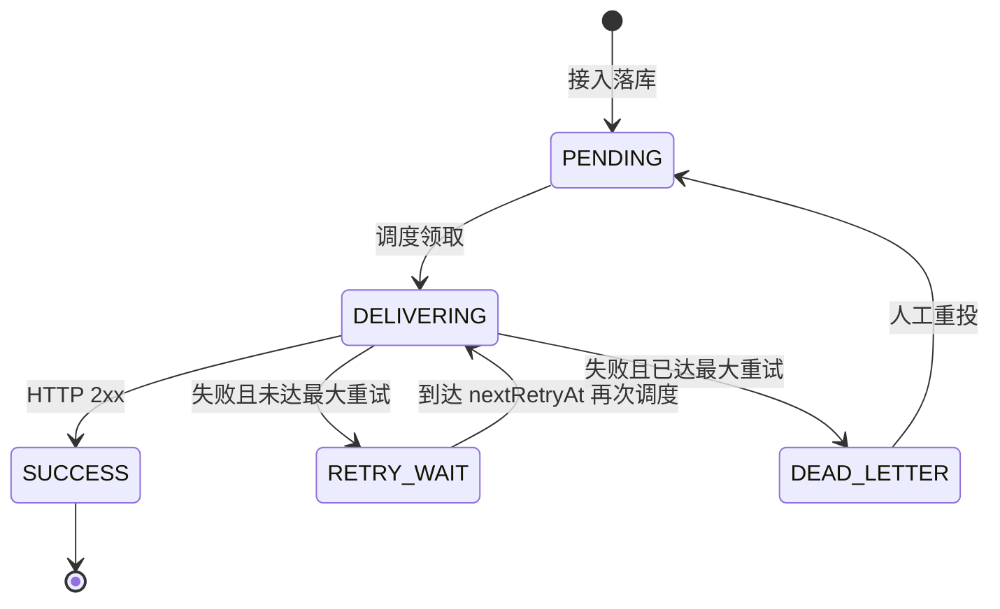

# 1. 系统定义

本系统是企业内部统一的 HTTP(S) 通知投递平台，负责接收业务系统提交的外部通知请求，并以至少一次投递语义将请求可靠投递到目标地址。
系统核心目标是稳定接收、可靠调度、可追踪、可重投，不承担外部系统业务语义处理。

# 2. 系统边界

## 2.1 负责解决

- 提供统一通知接入协议，屏蔽上游业务系统与不同外部供应商 API 的接入差异；
- 实现任务持久化与状态机管理，保障任务全生命周期可追踪；
- 实现失败重试与死信管理，提升通知最终送达概率；
- 提供任务查询与死信重投能力，支撑运维闭环。

## 2.2 明确不解决

- 不负责业务参数合法性与业务语义校验；
- 不保证外部系统业务处理成功，只以 HTTP 响应作为投递判定依据；
- 不负责外部系统幂等、保序与去重；
- 不做接口编排、签名、加密、字段映射等高级网关能力。

# 3. 核心语义与约束

## 3.1 投递语义

- 采用 At-Least-Once 语义；
- 平台保证任务不丢失并尽力投递；
- 平台允许重复投递，外部系统应基于 bizKey 做幂等处理。

## 3.2 成功与失败判定

- 成功判定：外部接口返回 HTTP 2xx；
- 失败判定：网络异常、超时、非 2xx 响应均视为失败。

## 3.3 接收成功判定

- 仅当任务成功持久化后，接口返回 `202 Accepted`；
- 若持久化失败，接口返回 5xx，调用方可重试提交。

# 4. 统一接入契约

请求体最小字段：

- `bizKey`：业务标识（供外部幂等使用）；
- `targetUrl`：目标外部 HTTP(S) 地址；
- `httpMethod`：请求方法，默认 POST；
- `headers`：请求头键值对；
- `body`：请求体原文。

接口返回：

- 成功：`202 Accepted` + `taskId`；
- 失败：4xx（基础必填校验失败）/ 5xx（平台异常）。

# 5. 调度架构选型

## 5.1 候选方案

| 方案 | 核心机制                                                                      | 优点 | 缺点 / 风险 | 适用阶段 |
|------|---------------------------------------------------------------------------|------|-------------|----------|
| **方案A：DB 状态机 + 周期扫描** | 调度器扫描 `delivery_task` 中可执行任务并直接投递                                         | 实现简单；链路短；一致性与排障成本低 | 扫描延迟；DB 压力更集中；扩展性一般 | MVP / 中小规模 |
| **方案B：CDC(binlog) + MQ 驱动投递** | 接入只写 `delivery_task`（含元信息+消息内容），CDC 订阅 binlog 并异步发布 MQ (消息内容)，Consumer 投递 | 解耦接入与执行；天然削峰；扩展性好；避免应用层跨表事务 | 引入 CDC 基础设施与运维复杂度；需处理发布/消费幂等与链路治理 | 大流量 / 生产规模 |

## 5.2 Trade-off 与决策

- **当前选择**：方案A（DB 状态机 + 周期扫描）。
- **选择理由**：MVP/demo 阶段优先保证实现完整、可解释、可验证，方案A更易快速闭环。
- **接受代价**：吞吐和实时性上限低于 MQ 方案。
- **演进路径**：吞吐或削峰需求明显时升级到方案B，保持状态机语义与重试策略抽象不变；可引入“按 `bizKey` 分区路由”（同 `bizKey` 进入同一分区）以尽最大可能保证单 key 有序，并通过多分区并行消费提升整体投递吞吐。CDC 仅负责把单表写入事件异步送入 MQ，后续调度与幂等规则与当前保持一致。

# 6. 整体架构与模块职责（基于方案A）

## 6.1 接入模块

- 暴露统一 HTTP 接口；
- 执行基础必填校验；
- 创建任务并返回 `taskId`。

## 6.2 调度模块

- 周期扫描可执行任务（`PENDING` 与满足 `nextRetryAt` 的 `RETRY_WAIT`）；
- 驱动状态流转并调用执行模块；
- 处理重试次数、重试时间和死信落转；
- 依赖可插拔重试策略计算 `nextRetryAt`（扩展点定义见第 8 节）。

## 6.3 投递执行模块

- 依据任务中的 URL/Method/Header/Body 发起外部 HTTP 请求；
- 统一封装响应与异常为投递结果。

## 6.4 持久化模块

- 持久化任务请求内容、状态、重试信息与错误信息；
- 支持按 taskId、bizKey、状态查询；
- 支持死信查询与人工重投操作。

# 7. 状态机设计

任务状态定义：

- `PENDING`：已接收待投递；
- `DELIVERING`：投递中；
- `RETRY_WAIT`：等待下次重试时间窗口；
- `SUCCESS`：投递成功；
- `DEAD_LETTER`：重试耗尽进入死信。

## 7.1 状态转换图与关键路径

关键路径说明：

- `PENDING -> DELIVERING -> SUCCESS`
- `DELIVERING -> RETRY_WAIT`（失败且 `retryCount < maxRetries`）
- `RETRY_WAIT -> DELIVERING`（`now >= nextRetryAt`）
- `DELIVERING -> DEAD_LETTER`（失败且 `retryCount >= maxRetries`）
- `DEAD_LETTER -> PENDING`（人工重投并重置重试相关字段）

# 8. 调度模块扩展点：重试策略

## 8.1 抽象边界

- **不变量**：失败后 `retryCount + 1`；仅当 `retryCount < maxRetries` 时进入 `RETRY_WAIT` 并设置 `nextRetryAt`；否则进入 `DEAD_LETTER`。
- **可变点**：如何计算下一次 `nextRetryAt`。
- **扩展方式**：采用 `RetrySchedulePolicy`（interface + 多实现），调度模块只依赖抽象。
- **状态归属约束**：策略实现保持无状态（stateless），任务真实状态统一落 DB（`retryCount`、`nextRetryAt`、`status`）。

## 8.2 策略选项与 MVP 取舍

| 选项 | 行为概要 | 优点 | 风险 |
|------|-----------|------|------|
| **固定间隔（Fixed）** | 每次失败后固定间隔 \(T\) 重试 | 实现最简单，行为可预测，demo 成本低 | 故障期可能出现重试共振 |
| **指数退避（Exponential）** | 间隔随次数指数增长（通常带 cap） | 长故障时更能保护下游 | 参数不当会导致等待过长 |
| **指数退避 + 抖动** | 在指数区间内随机化延迟 | 可打散尖峰，更适合规模化 | 可预测性下降，测试更复杂 |
| **按错误类型分支** | 按 429/503/4xx 分类退避 | 贴合 HTTP 语义，减少无效重试 | 配置与实现复杂度高 |

MVP 选型：

- **选择**：固定间隔（可配置 `maxRetries` + `retryInterval`）。
- **理由**：实现成本低、行为可重复、便于端到端演示与日志对齐。
- **代价**：下游故障窗口内保护能力弱于指数 + 抖动。
- **演进**：保持抽象不变，后续可切换到指数退避 + 抖动或按错误分类策略。

# 9. 可靠性与可运维性

## 9.1 可靠性措施

- 所有任务先落库后调度，避免进程重启导致内存任务丢失；
- 调度器无状态，支持多实例扩展。

## 9.2 运维能力

- 任务查询：按 `taskId`、`bizKey`、`status` 查询；
- 死信管理：分页查询 + 指定任务重投；
- 审计追踪：记录错误原因、重试次数、关键时间戳。

# 10. 非功能性目标（MVP）

- 吞吐：支持每分钟千级任务的稳定投递（单实例）；
- 可用性：服务重启不丢任务；
- 可观测性：具备成功率、失败率、死信数、重试数等基础指标。

